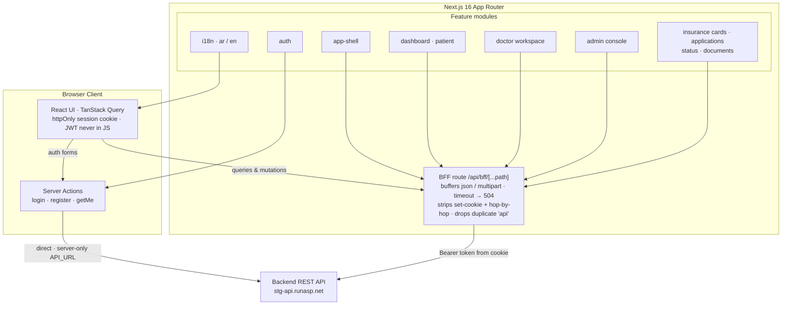

# Medical System — Government-Prototype Frontend

A Next.js 16 (App Router) frontend built with a strict **feature-based architecture**, talking to a separate backend (staging API at `http://stg-api.runasp.net`) through a **BFF proxy**. Fully bilingual **Arabic (default, RTL)** / **English (LTR)**.

---

## Architecture

The browser never talks to the backend directly. Authentication uses **server actions**, all other client queries and mutations go through a **BFF route** that injects the session token server-side.



The BFF route (`src/app/api/bff/[...path]/route.ts`) buffers request bodies (JSON as text, everything else as a binary buffer), enforces an upstream timeout (`AbortSignal.timeout`, default 10 s → `504`; generic failures → `502`), strips `set-cookie` plus forbidden and hop-by-hop headers, and drops a duplicate leading `api` path segment before forwarding with the session token as `Authorization: Bearer`.

---

## Tech Stack

| Category | Technology | Details |
|---|---|---|
| Framework | Next.js 16.2 | App Router + React Compiler |
| React | React 19.2 | Server Components by default |
| Language | TypeScript 5 | Strict mode |
| Data | `@tanstack/react-query` ^5.101.4 | Server-state per feature (`hooks/`); `@tanstack/react-table` ^8.21 for tables |
| Styling | Tailwind CSS v4 | `@tailwindcss/postcss`, CSS-first theme in `globals.css` |
| UI Kit | shadcn/ui | `radix-ui` ^1.6.7 primitives + `shadcn` CLI ^4.16.0, vendored in `src/components/ui` |
| Component variants | `class-variance-authority` ^0.7.1 | `cva()` used by vendored ui components |
| Forms | `react-hook-form` ^7.83 + `zod` ^3.25 | `@hookform/resolvers` ^5.5 |
| Internationalization | `next-intl` ^4.13.4 | Locale routing + per-feature messages |
| Lint / Format | Biome 2.2 | Replaces ESLint + Prettier (`biome check` / `biome format`) |
| Tests | Vitest ^4.1.10 | `happy-dom` ^20.11.1 default / `jsdom` ^29.1.1 devDeps, `node` env for server-only tests, Testing Library |
| Charts | `recharts` ^3.8.0 | Admin dashboard charts |
| Theme | `next-themes` ^0.4.6 | Light / dark mode |
| Animation | `tw-animate-css` ^1.4.0 | Tailwind animation utilities |
| Drag & drop | `@dnd-kit` | Sortable UI |
| Extras | `sonner` (toasts) · `vaul` (drawers) · `lucide-react` (icons) · `clsx` + `tailwind-merge` (`cn()`) | |

---

## Architecture Notes

- **BFF + httpOnly cookie:** the JWT lives only in the `session` cookie (`src/lib/server-auth.ts`) — never in client JS. React context holds the parsed `User`.
- **Server actions for auth:** `login`, `register`, and `getMe` call the backend directly from `src/features/auth/actions.ts` using the server-only `API_URL`.
- **Delete Test:** every business domain lives in `src/features/[feature]`. Deleting a feature folder must leave the app compiling.
- **Rule of Two:** code only moves to shared `src/components/` / `src/lib/` when used by at least two distinct features.
- **No barrel files:** import from the source file path (`@/features/.../components/foo`), never `index.ts` re-exports.
- **Named React imports:** `import { useState } from 'react'`, never `React.useState` in authored feature/lib code. The vendored shadcn code (`src/components/ui/*`, biome-ignored) and `src/hooks/use-mobile.ts` legitimately use `React.useState` / `React.useEffect`; the rule applies to all other authored code.
- **Thin app routes:** `page.tsx` files only handle params, metadata, and delegating to a feature component — no business logic.
- **Per-feature translations:** `src/features/<f>/translations/{en,ar}.json`, registered in `src/i18n/request.ts` (namespaces: `auth`, `app-shell`, `dashboard`, `doctor`, `admin`).
- **`API_URL` is server-only** — never exposed to the client (no `NEXT_PUBLIC_*`).

---

## Directory Structure

```text
src/
├── app/                      # Routing layer — thin, no business logic
│   ├── api/bff/[...path]/    # BFF proxy (route.ts + node-env tests)
│   └── [locale]/             # Localized routes (ar default / en)
│       ├── layout.tsx        # Fonts, dir (rtl/ltr), AuthProvider, ThemeProvider, Toaster
│       ├── auth/             # Login / register
│       ├── dashboard/        # Patient portal
│       │   ├── insurance/{applications,cards,dependents,documents,eligibility,status}/
│       │   ├── profile/
│       │   └── visits/
│       ├── doctor/           # Doctor workspace
│       │   ├── patients/[patientId]/
│       │   └── visits/[visitId]/
│       └── admin/            # Admin console
│           └── audit/
├── components/               # Shared, domain-agnostic UI
│   ├── ui/                   # shadcn/ui vendor (radix primitives, direction, sonner)
│   ├── query-provider.tsx    # TanStack Query provider (server + browser singleton)
│   └── theme-toggle.tsx
├── features/                 # Business domains (Delete Test)
│   ├── auth/                 # api/, actions.ts, auth-context.tsx, hooks/, translations/
│   ├── app-shell/            # Shell, role guards, nav items, states
│   ├── dashboard/            # Patient portal
│   ├── doctor/               # Doctor workspace
│   ├── admin/                # Admin console (dashboard + audit logs)
│   ├── insurance-cards/      # api/, hooks/, types.ts
│   ├── insurance-applications/
│   ├── insurance-dependents/
│   ├── insurance-documents/
│   ├── insurance-eligibility/
│   ├── insurance-status/
│   ├── insurance-verification/
│   ├── patients/             # API client layer
│   ├── visits/               # API client layer
│   ├── audit-logs/           # API client layer
│   ├── assignments/ · attachments/ · profile/
├── i18n/                     # routing.ts, request.ts, navigation.ts
├── lib/                      # http.ts, bff.ts, proxy-utils.ts, server-auth.ts, api/
├── styles/globals.css        # Tailwind v4 theme (Coolors blue palette)
├── test/setup.ts             # Vitest setup (API_URL for tests)
└── proxy.ts                  # next-intl middleware — locale redirect (root → /ar)
```

---

## Environment Setup

There is no committed `.env.example` — create `.env` manually with:

```bash
API_URL=http://stg-api.runasp.net   # Backend base URL — server-only, required
BFF_TIMEOUT_MS=10000                # BFF upstream timeout in ms (1–60000, default 10000)
```

```bash
npm install
# create .env as above
npm run dev
# → http://localhost:3000 (redirects to /ar or /en)
```

### Available Scripts

| Command | Description |
|---|---|
| `npm run dev` | Next.js development server |
| `npm run build` | Production build |
| `npm run start` | Serve the production build |
| `npm run lint` | Biome check |
| `npm run format` | Biome format (writes; markdown included) |
| `npm run test` | Vitest run (single pass) |
| `npm run test:watch` | Vitest watch mode |

---

## Testing

Vitest 4 — **218 tests across 70 files passing** (verified 2026-08-04). The suite covers the BFF route proxy behavior, the API client (`lib/http.ts`, `lib/bff.ts`), auth server actions, dashboard, app-shell, admin, and insurance hooks.

- Default test environment is `happy-dom` (config in `vitest.config.ts`).
- Server-only code (BFF route, `proxy-utils`) uses `// @vitest-environment node` with mocked `fetch`.
- `src/test/setup.ts` pins `process.env.API_URL = 'http://stg-api.runasp.net'` for tests.

---

## Internationalization / RTL

| Locale | Code | Direction |
|---|---|---|
| Arabic (default) | `ar` | RTL |
| English | `en` | LTR |

- Locale-based routing via `src/i18n/routing.ts` (`locales: ['ar', 'en']`, `defaultLocale: 'ar'`, `localePrefix: 'always'`).
- `src/i18n/request.ts` registers per-feature translation namespaces; `src/i18n/navigation.ts` provides locale-aware navigation helpers.
- `src/proxy.ts` (Next 16's renamed middleware) runs the next-intl middleware: browser redirect to `/ar` or `/en`; the matcher excludes `api`, `trpc`, `_next`, `_vercel`, and static assets.
- Direction is applied in `src/app/[locale]/layout.tsx` via `rtlLocales = ['ar']` and a Radix `DirectionProvider`.
